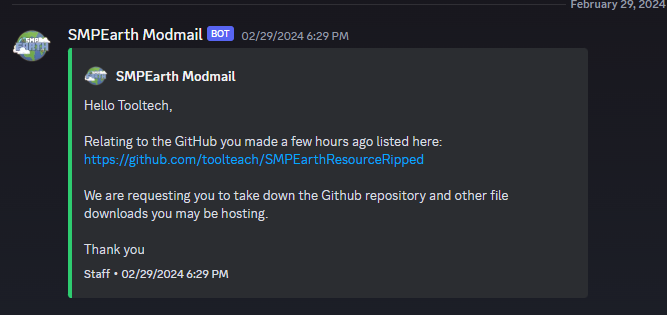

owo whats this
---

>SMPEarth corrupted their server resource packs as a countermeasure for people trying to rip it, however if the client can read it then something else can, and now we have this.

> Includes
>* Classic
>* Empty
>* Fall
>* Festive
>* Holloween
>* Pride
>* Utopia
>* Winter

Packs above contain some modern assets such as staff badges and others
>New badge example:
> 
>>
>
>Old badge example:
> 
> 
>>
>
> these texture changes make no sense 

>Badge Changes
> 
> removed:
> 
> >

> 
> 
> Added:
> 
> >

> 

> 
> Other changes:
> 
> * Changed every badge to bigger resolution and retextured them all
> * added 

 as chat icons
> * Removed old README.md (why would they do this)
> * Changed "director" back to "Manager" (godbless)
>
> 

>Other random Assets
>* Old Fall
>* 2020 Resource Pack 
>
>Old Fall includes old staff badges and other related textures used late 2021 to late 2022
>
>2020 Resource Pack includes textures used from late 2020, there  is no order with this one, it was 
just taken from a old SSD I used during 2020.
> 

>Honourable mention 
> 
> >
> 
>Try improving the server instead.

